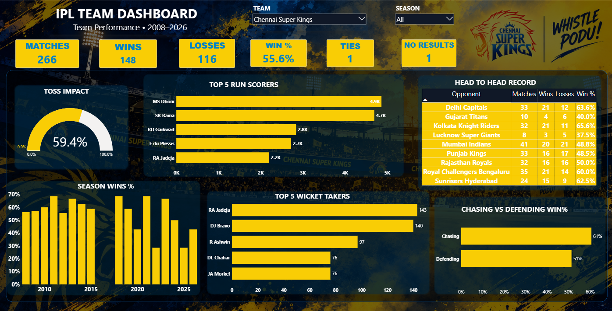
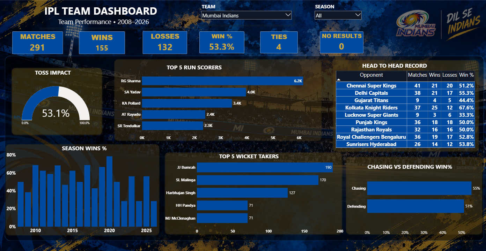
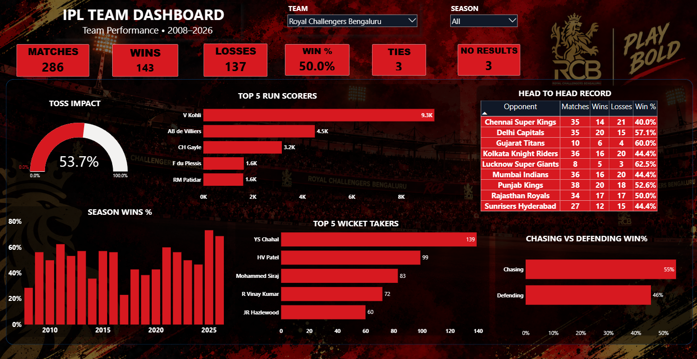
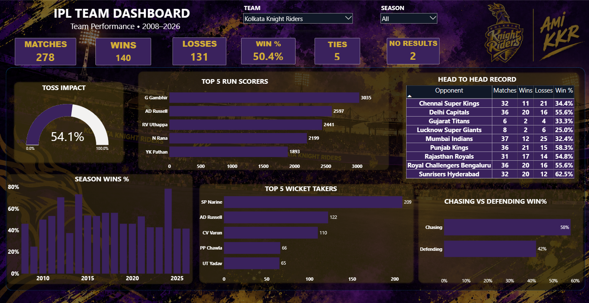
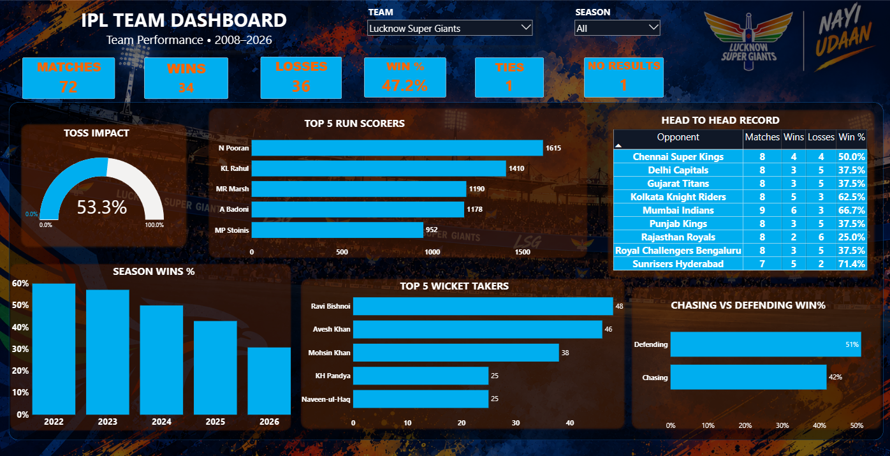
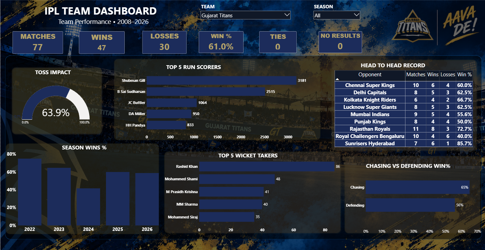
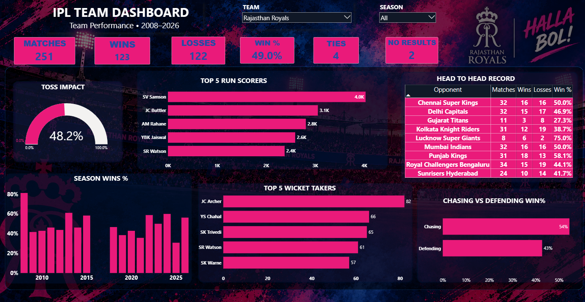
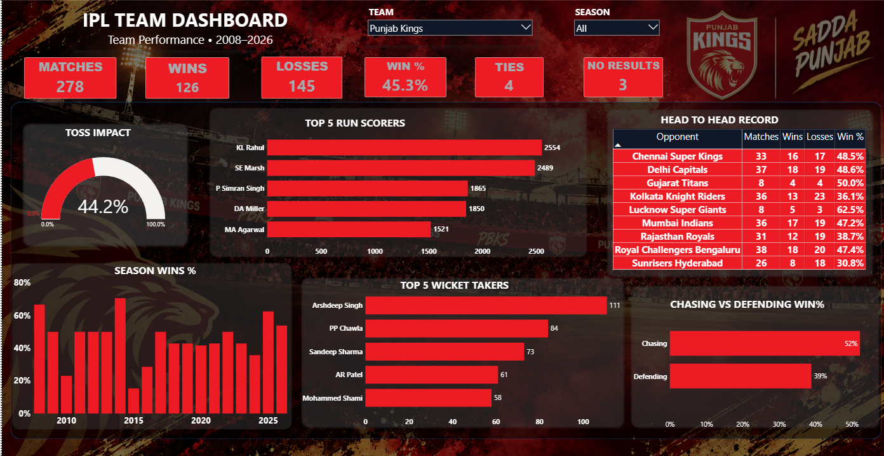
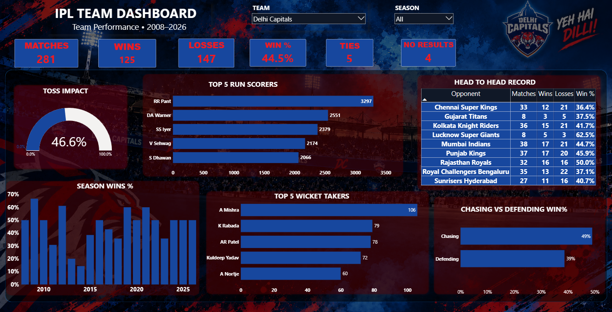
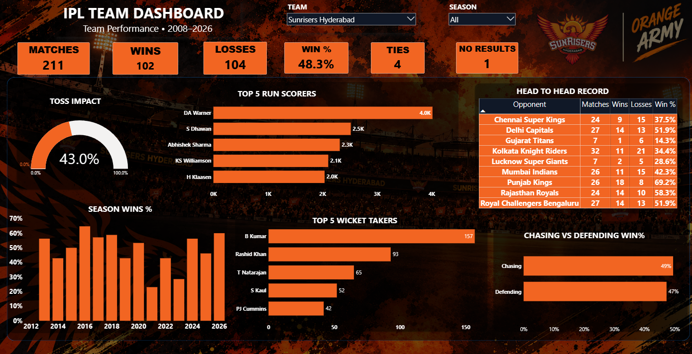

# 🏏 IPL Team Performance Dashboard

An interactive **Power BI dashboard** designed to analyze and compare the performance of IPL teams across seasons from **2008 to 2026**.

The dashboard provides a team-level overview of match performance, season trends, batting and bowling contributions, head-to-head records, toss impact, and chasing vs defending performance.

---

## 📊 Dashboard Preview












---

## 🎯 Project Objective

The objective of this project is to build an interactive dashboard that provides a quick and clear overview of an IPL team's historical performance.

Users can select a team and season to dynamically explore the available statistics and performance trends.

---

## ✨ Key Features

### 🏆 Team Performance

- Matches Played
- Wins and Losses
- Win Percentage
- Ties
- No Results

### 📈 Season Performance

- Season-wise Win Percentage
- Performance trends across IPL seasons

### 🏏 Batting Analysis

- Top 5 Run Scorers
- Team-wise batting performance

### 🎯 Bowling Analysis

- Top 5 Wicket Takers
- Team-wise bowling performance

### ⚔️ Head-to-Head Analysis

- Matches against each opponent
- Wins and losses
- Head-to-head win percentage

### 🪙 Toss Analysis

- Total tosses won
- Matches won after winning the toss
- Toss → Match Win Percentage

### 🏃 Chasing vs Defending

- Matches played while chasing
- Matches played while defending
- Win percentage in each situation

### 🎨 Dynamic Team Experience

- Team-specific background images
- Dynamic team colors
- Interactive team and season selection

---

## 🛠️ Tools & Technologies

- **Power BI Desktop**
- **Power Query**
- **DAX**
- **Microsoft Excel / CSV**
- **Git & GitHub**

---

## 🗂️ Data Model

The dashboard follows a simple dimensional data model:

```text
Dim_Date
    │
    └── Fact_Match
             │
             └── Fact_Ball

Dim_Team
    │
    └── Team_Background
